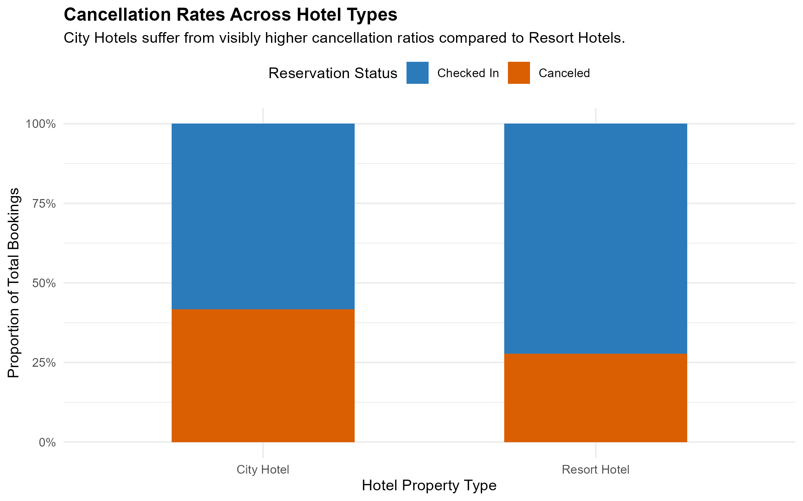
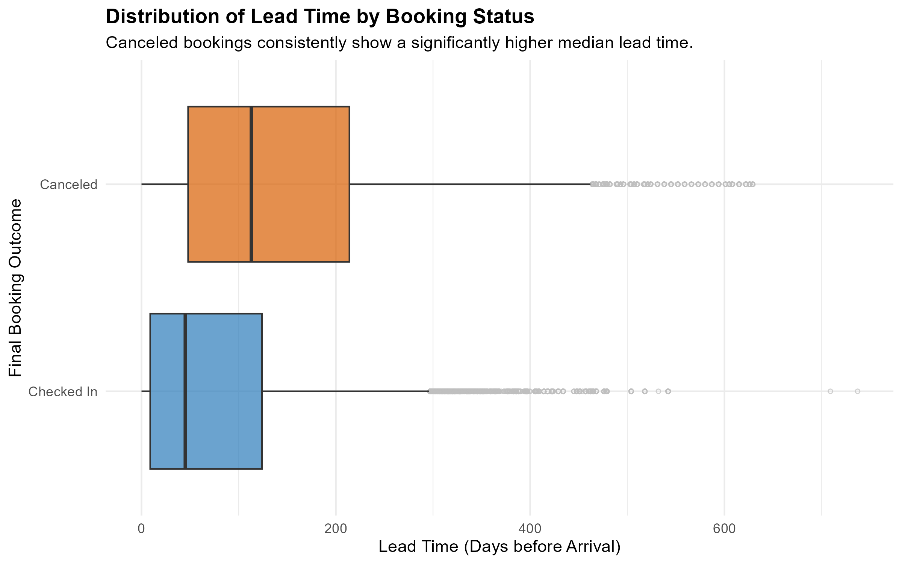
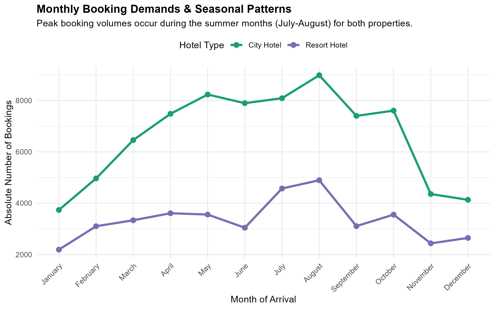
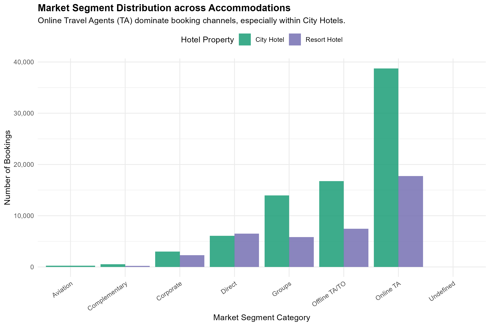

## Executive Summary
This section covers the Exploratory Data Analysis (EDA) of our hotel booking dataset. By looking closely at booking behaviors, seasonal trends, and channel performance, we want to find the key patterns that will help us build and train our predictive models later on.

---

## 1. Operational Proportions: Baseline Cancellation Ratios

### Section Analysis
Comparing the two hotel types, we can see a clear difference in their baseline cancellation rates. City Hotels have a much higher percentage of cancellations than Resort Hotels. This makes sense because city travelers—often booking for business or short trips—likely have more flexible or volatile schedules compared to people booking long-term leisure stays at resorts.

---

## 2. Lead Time Thresholds and Commitment Decay

### Section Analysis:
When we look at the lead time (how many days in advance a room is booked), there's a really clear trend: the further out someone books, the more likely they are to cancel. Canceled bookings have a much higher median lead time than bookings where guests actually checked in. This tells us that long booking horizons introduce a lot of uncertainty, making lead time a crucial feature for our upcoming predictive models.

---

## 3. Macro Seasonal Demand Volatility

### Section Analysis:
Looking at monthly booking volume, both hotels show a strong seasonal pattern. Bookings spike significantly in the third quarter, peaking during July and August. This aligns perfectly with summer vacation season. Knowing these peak months helps us understand when the hotels face the highest traffic, which is highly useful for yield management and staffing.

---

## 4. The Policy Paradox: Deposit Types vs. Cancellations

### Section Analysis:
The deposit type data reveals a surprising paradox. You would expect "Non-Refundable" bookings to have the lowest cancellation rates since guests lose their money. However, the data shows almost all Non-Refundable bookings ended up canceling. This counterintuitive trend might happen because travel agencies or tour operators reserve large blocks of rooms under non-refundable terms and then cancel or default on them when plans change.

---

## 5. Ecosystem Inflow: Market Segment Channels

### Section Analysis:
Looking at where bookings come from, Online Travel Agents (TAs) are by far the biggest source of bookings for both hotel types, but especially for City Hotels. This shows just how dependent these hotels are on third-party booking platforms like Expedia or Booking.com, whereas direct bookings or corporate channels make up a much smaller slice of the pie.