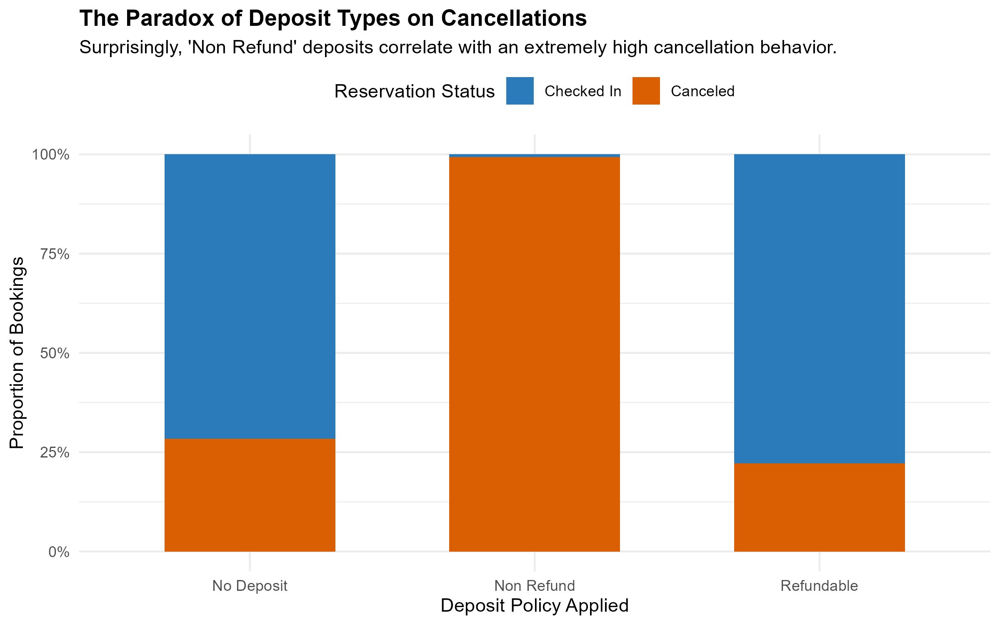

## Executive Summary
This module focuses on the **Exploratory Data Analysis (EDA)** phase of the Hotel Booking Demand dataset. By analyzing behavioral dependencies, seasonal distribution channels, and booking attributes, these insights establish the structural foundation for predictive modeling.

---

## 1. Operational Proportions: Baseline Cancellation Ratios

### Text-Based Analysis:
A comparative assessment of core booking outcomes reveals a clear variance between property classifications. City Hotels display a substantially higher proportional baseline cancellation rate relative to Resort Hotels. This baseline fluctuation indicates that urban travelers maintain a significantly more volatile reservation cycle than leisure-driven resort clientele.

---

## 2. Lead Time Thresholds and Commitment Decay

### Text-Based Analysis:
The mathematical distribution of lead time uncovers a critical predictive metric: booking volatility increases the earlier a room is reserved. The median lead time for canceled transactions shifts deep into the timeline compared to successful check-ins. This confirms that extended scheduling horizons introduce higher probability for external disruptions.

---

## 3. Macro Seasonal Demand Volatility

### Text-Based Analysis:
Mapping absolute booking density onto a macro monthly sequence displays pronounced seasonal trends. Both operations experience a synchronized demand surge during the third quarter, peaking across July and August. This peak reflects global summer holiday patterns.

---

## 4. The Policy Paradox: Deposit Types vs. Cancellations

### Text-Based Analysis:
An evaluation of commercial policies reveals a distinct data mining paradox. While intuition suggests "Non-Refundable" agreements should secure reservation retention, the empirical data shows a near-total concentration of cancellations within this category. This dynamic often points to mass structural bookings from institutional travel agencies who systematically default during market variations.

---

## 5. Ecosystem Inflow: Market Segment Channels

### Text-Based Analysis:
Breaking down client acquisition funnels demonstrates a heavy reliance on modern digital distribution structures. Online Travel Agents (TAs) are the primary pipeline driving incoming reservation volume for both properties, with an especially massive footprint in City Hotels. This highlights the industry's strong dependence on aggregators over direct corporate channels.